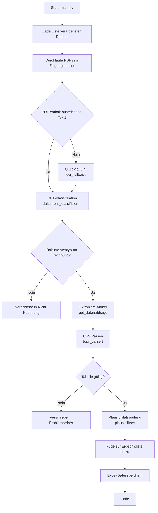

```mermaid
flowchart TD
    A[Start: main.py] --> B[Lade Liste verarbeiteter Dateien]
    B --> C[Durchlaufe PDFs im Eingangsordner]
    C --> D{PDF enthält ausreichend Text?}
    D -- Ja --> E["GPT-Klassifikation\ndokument_klassifizieren"]
    D -- Nein --> F["OCR via GPT\nocr_fallback"]
    F --> E
    E --> G{Dokumententyp == rechnung?}
    G -- Nein --> H[Verschiebe in Nicht-Rechnung]
    G -- Ja --> I["Extrahiere Artikel\ngpt_datenabfrage"]
    I --> J["CSV Parsen\n(csv_parser)"]
    J --> K{Tabelle gültig?}
    K -- Nein --> L[Verschiebe in Problemordner]
    K -- Ja --> M["Plausibilitätsprüfung\nplausibilitaet"]
    M --> N[Füge zur Ergebnisliste hinzu]
    N --> O[Excel-Datei speichern]
    O --> P[Ende]
```